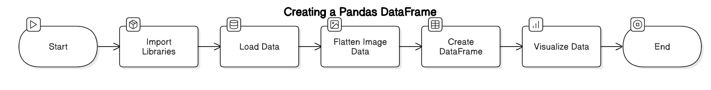
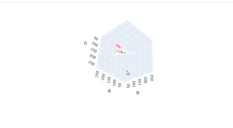
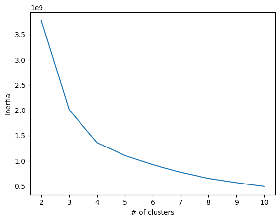

# Adire-Image-Compression-Using-KMeans-Clustering-Algorithm
On this project, image compression was performed on Adire shirt, a cultural textile design in south-west Nigeria, Africa. This repository contains the code and environmental resources for the said project using the kmeans algorithm.

# About Kmeans Model
KMeans is one of the most straightforward and popular unsupervised machine learning algorithms. Its simplicity, efficiency and most importantly, versatility are what set it apart. Whether you’re in for image compression, customer segmentation, genomics or anomaly detection, you see, KMeans is your guy.

# Objectives
* Carry out preprocessing on the input image data to prepare it for modeling.
* Visualize the data points to better understand the colour clusters and swatches.
* Fitting the kmeans clustering algorithm on the data in order to attain an optimal clustering across the centroids.
* Optimizing the model and finding the optimal k values.
* Evaluating the model using major evaluation metrics like inertia and silhouette scores.

# Environmental Setup and Package Installation

# Preprocessing the Input Image Data
Conversion of the image data into a row-column data in RGB dimension. Processing revealed that the data has 1112320 x 3 dimension. However, due to our computing power, a sample of 700,00
was taken for the 3d plot.

  

# Visualization
Having plotted the colour swatches on the Adire photograph, the results is as thus:

# instantiation and fitting of the model
With the number of centroids k = 6

  

# Optimizing the k values from 2 through 11
In a bid to visualize the clustering ability of the kmean model across different number of clusters (k), a function that displays the said image across multiple values of k is written.

  

# Evaluating the model using major evaluation metrics like inertia and silhouette scores.
Moving on, the model is evaluated using the elbow method by plotting different inertia scores across multiple k-values (for instance, 2 through 11).

  

Another useful metric for model performance evaluation is the silhouette score, which is contained in the repository.

